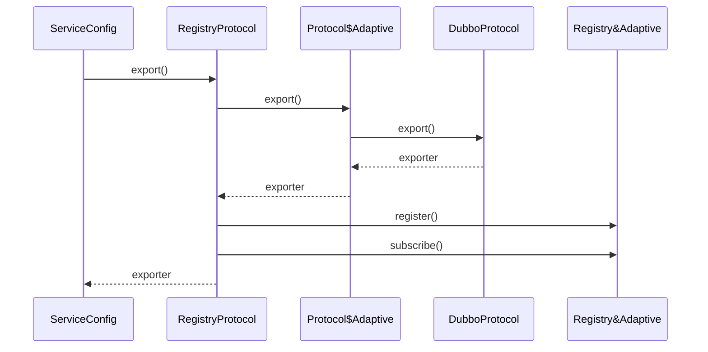
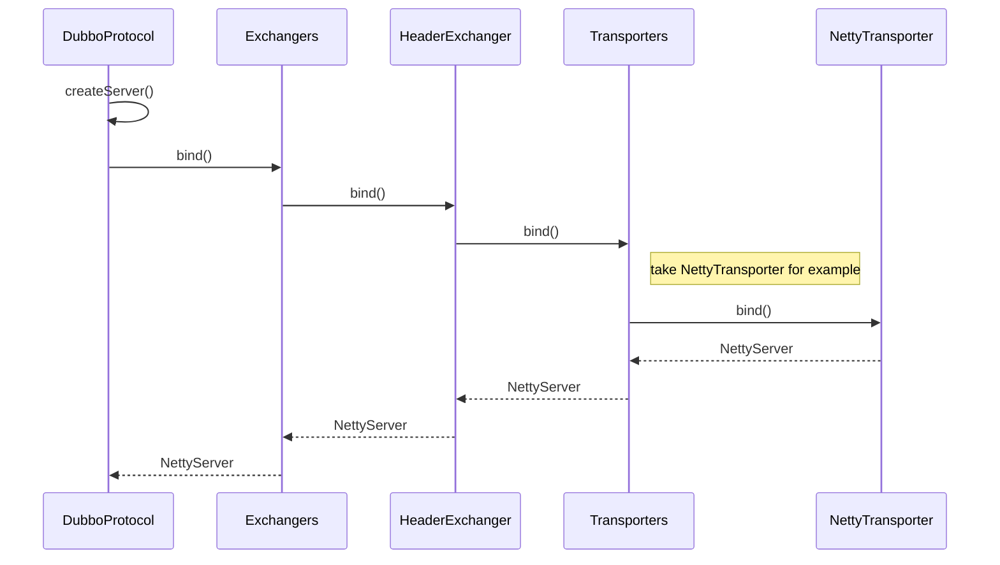
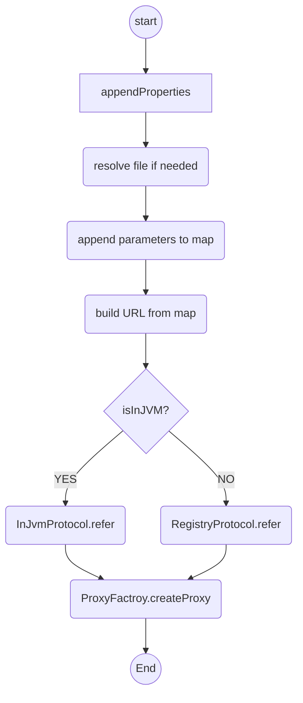

# dubbo extension
## ExtensionLoader\<T> 
>- 每个T类型对应一个ExtensionLoader，同时缓存在EXTENSION_LOADERS中.

>- 每个ExtensionLoad\<T>中包含:
>>- Extension*，\<name,Extension> pair
>>- 一个AdaptiveExtension
>>- ActivateExtension*

>- 该ExtensionLoader通过spi机制加载该T类型对应的所有extension，spi机制如下

## spi机制
>- 通过@SPI注解识别需要加载扩展点的类型T,type = T.class

>- 加载dir下所有配置的扩展点配置文件,文件名 fileName = dir + type.getName().

>- dir=META-INF/dubbo/internal;META-INF/dubbo/;META-INF/services/

>- 例如:T = com.alibaba.dubbo.common.extension.ExtensionFactory，filename = META-INF/dubbo/internal/com.alibaba.dubbo.common.extension.ExtensionFactory

```
#com.alibaba.dubbo.common.extension.ExtensionFactory
adaptive=com.alibaba.dubbo.common.extension.factory.AdaptiveExtensionFactory
spi=com.alibaba.dubbo.common.extension.factory.SpiExtensionFactory
```

>- 如果@SPI加了name，那么该name作为extension的default name，在XXX$Adaptive中，如果没有传入extname，那么将使用defaultname作为默认的extension

```java

@SPI(FailoverCluster.NAME)
public interface Cluster {

    /**
     * Merge the directory invokers to a virtual invoker.
     *
     * @param <T>
     * @param directory
     * @return cluster invoker
     * @throws RpcException
     */
    @Adaptive
    <T> Invoker<T> join(Directory<T> directory) throws RpcException;

}

failover=com.alibaba.dubbo.rpc.cluster.support.FailoverCluster
```

>- 如果类型T扩展点中有加@Adaptive注解的，将其缓存，作为T类型默认的extension，否则会通过字节码的方式新增一个T$Adaptive作为T的默认extension，并且AdaptiveExtension只能有一个，@Adaptive作用如下


## @Adaptive
>- 类级别：dubbo通过spi机制加载AdaptiveExtension，参见 [spi机制](#spi机制)

>- 方法级别：如果某接口中的任意方法标记了@Adaptive,dubbo会为该接口创建一个代理类 ，类名xxx$Adaptive，该类用来在运行时为@Adaptive方法提供动态适配的功能。适配策略如下：
>>- 如果@SPI内加了参数，那么该参数作为defaultExtName，如果方法上@Adaptive内的参数为空，那么将使用defaultExtName来获取对应的extension
```java
String[] value = method.getAnnotation(Adaptive.class).value();
String defaultExtName = cachedDefaultName;
...
getNameCode = String.format("url.getParameter(\"%s\", \"%s\")", value[i], defaultExtName);
                            
```

>- 加了@Adaptive的方法需要满足以下条件的任意一个：

>>- 方法参数中有任意一个是URL类型
>>- 方法参数中有任意一个返回URL类型的get方法。

>- 以Protocol为例：

```java
package com.alibaba.dubbo.rpc;

import com.alibaba.dubbo.common.extension.ExtensionLoader;

public class Protocol$Adaptive implements com.alibaba.dubbo.rpc.Protocol {
    public void destroy() {
        throw new UnsupportedOperationException("method public abstract void com.alibaba.dubbo.rpc.Protocol.destroy() of interface commonom.alibaba.dubbo.rpc.Protocol is not adaptive method!");
    }

    public int getDefaultPort() {
        throw new UnsupportedOperationException("method public abstract int com.alibaba.dubbo.rpc.Protocol.getDefaultPort() of interface com.alibaba.dubbo.rpc.Protocol is not adaptive method!");
    }

    public com.alibaba.dubbo.rpc.Invoker refer(java.lang.Class arg0, com.alibaba.dubbo.common.URL arg1) throws com.alibaba.dubbo.rpc.RpcException {
        if (arg1 == null) throw new IllegalArgumentException("url == null");
        com.alibaba.dubbo.common.URL url = arg1;
        String extName = (url.getProtocol() == null ? "dubbo" : url.getProtocol());
        if (extName == null)
            throw new IllegalStateException("Fail to get extension(com.alibaba.dubbo.rpc.Protocol) name from url(" + url.toString() + ") use keys([protocol])");
        com.alibaba.dubbo.rpc.Protocol extension = (com.alibaba.dubbo.rpc.Protocol) ExtensionLoader.getExtensionLoader(com.alibaba.dubbo.rpc.Protocol.class).getExtension(extName);
        return extension.refer(arg0, arg1);
    }

    public com.alibaba.dubbo.rpc.Exporter export(com.alibaba.dubbo.rpc.Invoker arg0) throws com.alibaba.dubbo.rpc.RpcException {
        if (arg0 == null) throw new IllegalArgumentException("com.alibaba.dubbo.rpc.Invoker argument == null");
        if (arg0.getUrl() == null)
            throw new IllegalArgumentException("com.alibaba.dubbo.rpc.Invoker argument getUrl() == null");
        com.alibaba.dubbo.common.URL url = arg0.getUrl();
        String extName = (url.getProtocol() == null ? "dubbo" : url.getProtocol());
        if (extName == null)
            throw new IllegalStateException("Fail to get extension(com.alibaba.dubbo.rpc.Protocol) name from url(" + url.toString() + ") use keys([protocol])");
        com.alibaba.dubbo.rpc.Protocol extension = (com.alibaba.dubbo.rpc.Protocol) ExtensionLoader.getExtensionLoader(com.alibaba.dubbo.rpc.Protocol.class).getExtension(extName);
        return extension.export(arg0);
    }
}
```


## @Activate
通过指定key，group来选择满足条件的extension。判断一个url是否能够激活对应的extension逻辑如下：
```java
private boolean isActive(Activate activate, URL url) {
        String[] keys = activate.value();
        if (keys == null || keys.length == 0) {
            return true;
        }
        for (String key : keys) {//任意一个key满足条件即可
            for (Map.Entry<String, String> entry : url.getParameters().entrySet()) {//url中re
                String k = entry.getKey();
                String v = entry.getValue();
                if ((k.equals(key) || k.endsWith("." + key))
                        && ConfigUtils.isNotEmpty(v)) {
                    return true;
                }
            }
        }
        return false;
    }
```

## wrapper
wrapper的是用来在原生接口类型T的extension上面进行包装，成为wrapper需要满足以下条件：
>- 1、必须实现T

>- 2、必须有T类型的构造方法

wrapper按照配置文件中定义，层层嵌套（没有循序），以Protocol为例，创建extension的过程如下：
>- 1、通过spi机制加载所有的extension

>- 2、根据name=dubbo找到对应的extension：DubboExtension

>- 3、注入DubboExtension的属性

>- 4、得到对应的所有wrapper

>- 5、根据配置文件的定义，层层嵌套：

>>- 创建ProtocolFitlerWrapper实例，并注入protocol属性DubboProtocol
>>- 创建ProtocolListenerWrapper实例，并注入protocol属性ProtocolFitlerWrapper
>>- 注意：以上wrapper注入没有顺序，有可能先生成listener后生成fitler

>- 6、返回ProtocolListenerWrapper实例


##  extension的注入
extension依赖的T都是注入的T$Adaptive类型

## 一个完整的extension创建过程
>- 通过spi机制加载配置文件中所有的extension

>- 创建extension实例

>>- class.newInstance

>>- injectExtension

>>- 获取所有的wrapperClasses

>>- 通过wrapper机制包装extension instance

>>- 返回wrapper

>- 缓存extension

# export

整体链路
----------




DubboProtocol.export过程
----------




>- ServiceConfig.doExportUrlsFor1Protocol
>> 根据服务提供的url遍历所有注册中心的地址，进行export

>>- appendProperties(map)&&new URL(map)
>>> 补全参数，创建url

>>- originalInvoker = ProxyFactory.getInvoker(ref)
>>> 获取原始的invoker，该invoker只是用来动态的调用service方法

>>- RegistryProtocol.export(originalInvoker)
>>> 本地暴露&注册

>>>- exporter = doLocalExport(originInvoker)
>>>> 本地暴露，由Protocol$Adaptive完成

>>>>- Invoker<?> invokerDelegete = new InvokerDelegete<T>(originInvoker, getProviderUrl(originInvoker));
>>>>> 将registry url转为provider url

>>>>- Protocol$Adaptive.export(invokerDelegete)
>>>>> 内部执行server创建等逻辑

>>>- registry.register && registry.subscribe
>>>> 注册

>>>- return exporter


#  reference

初始化过程
-----------


## dubbo的一些问题

1、url.getMethodParameter（methodName,key）只能通过方法名和key来获取参数值，但是如果接口中有重载的方法，那么这些方法中只要有任意一个声明了诸如filter的参数后，其他重载方法也会生效。原因就是并未在方法参数层面做区分。

比如：
```xml
<dubbo:reference id="demoService" check="false" interface="com.alibaba.dubbo.demo.DemoService" timeout="1000" retries="0" >
        <dubbo:method name="sayHello" fuse="hystrix" ></dubbo:method>
</dubbo:reference>
```
DemoService:
```java
package com.alibaba.dubbo.demo;

public interface DemoService {

    String sayHello(String name);

    String sayHello1(String name);

    String sayHello(String name, String world);//重载

}
```
DemoService.sayHello有两个重载方法。

在DemoService的sayHello方法上面声明使用熔断器fuse=hystrix，但是无法区分是哪一个，所以两个方法都会使用fuse=hystrix

2、Spring加载顺序问题
afterPropertiesSet和getObject方法的调用顺序不确定

<!--stackedit_data:
eyJoaXN0b3J5IjpbMjYwMjI4NDk3XX0=
-->