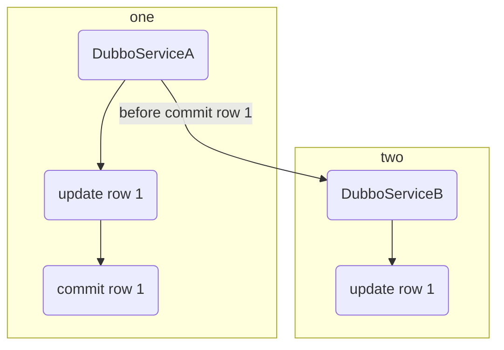

# 案例1，数据库死锁导致的服务超时

```mermaid
graph TB

subgraph two
c(DubboServiceB) --> d(update row 1)

end
subgraph one
a(DubboServiceA) --> b(update row 1)
b --> f(commit row 1)
a --before commit row 1--> c

end
```

<!--stackedit_data:
eyJoaXN0b3J5IjpbMzE4MDc1NjY1XX0=
-->