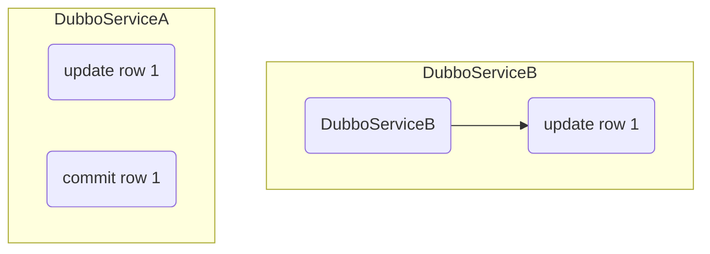

# 案例1，数据库死锁导致的服务超时

```mermaid
graph TB

subgraph DubboServiceB
c(DubboServiceB) --> d(update row 1)

end
subgraph DubboServiceA
a(update row 1)
b(commit row 1)

end
```

<!--stackedit_data:
eyJoaXN0b3J5IjpbLTE1Njc1NjgyNjBdfQ==
-->