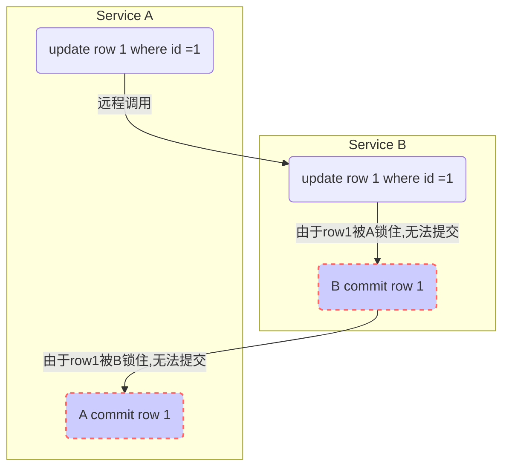

# 案例1，数据库锁导致的服务超时
由于service拆分的并不彻底，不同的service都直接操作了同一条数据，如下：

### 问题分析
几种情况(不考虑网络延迟，A->涵盖在A事务内)：
>- 1、如果B 事务的超时时间大于A->B的超时时间：
>>- A->B超时，导致A事务回滚（A事务内），释放行锁
>>- A失败 B失败

>- 2、如果B事务的超时时间小于A->B的超时时间：
>>>- 2.1 如果B事务的超时时间大于A事务的超时时间
>> A失败 B 成功 A->B成功
>>>- 2.2 如果B事务的超时时间小于A事务的超时时间
>> A失败 B 失败 A->B失败

基本上 A和B的超时时间是一样的，但是由于A先获取锁，所以A先释放锁，可当做A的超时小于B的超时来处理
### 解决办法
<!--stackedit_data:
eyJoaXN0b3J5IjpbLTM1MjE2MDgwMF19
-->