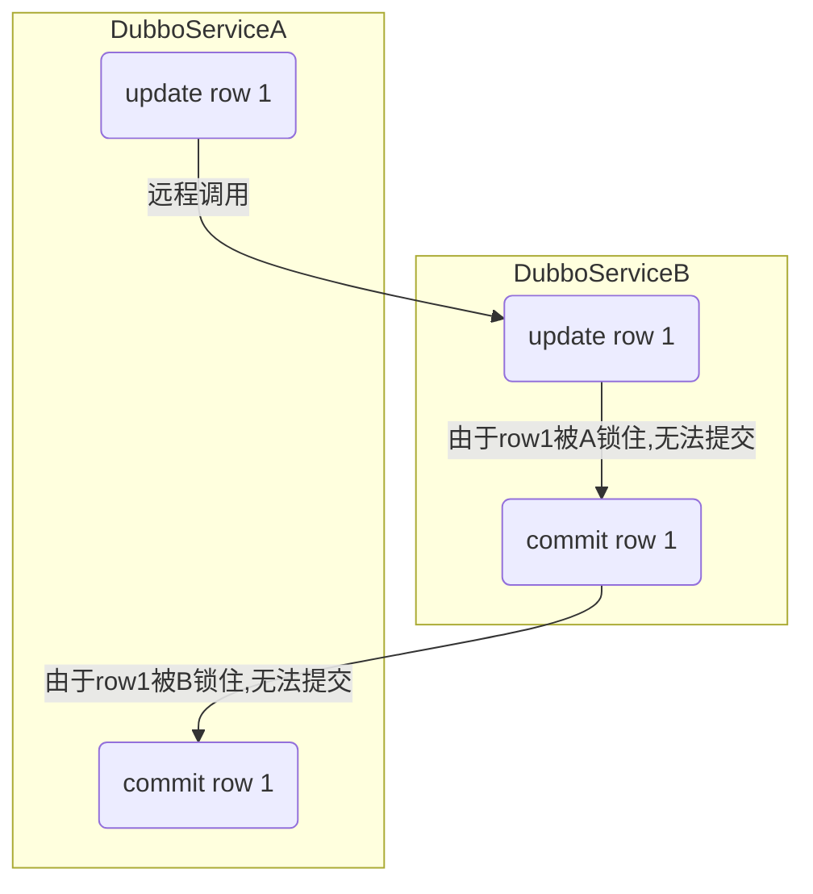

# 案例1，数据库死锁导致的服务超时

```mermaid
graph TB

subgraph DubboServiceB
c(update row 1)
d(commit row 1)
end
subgraph DubboServiceA
a(update row 1)
b(commit row 1)

a --远程调用--> c
d --由于row1被B锁住,无法提交--> b
c --由于row1被A锁住,无法提交--> d
end
```

<!--stackedit_data:
eyJoaXN0b3J5IjpbODE1ODAyMTU1XX0=
-->