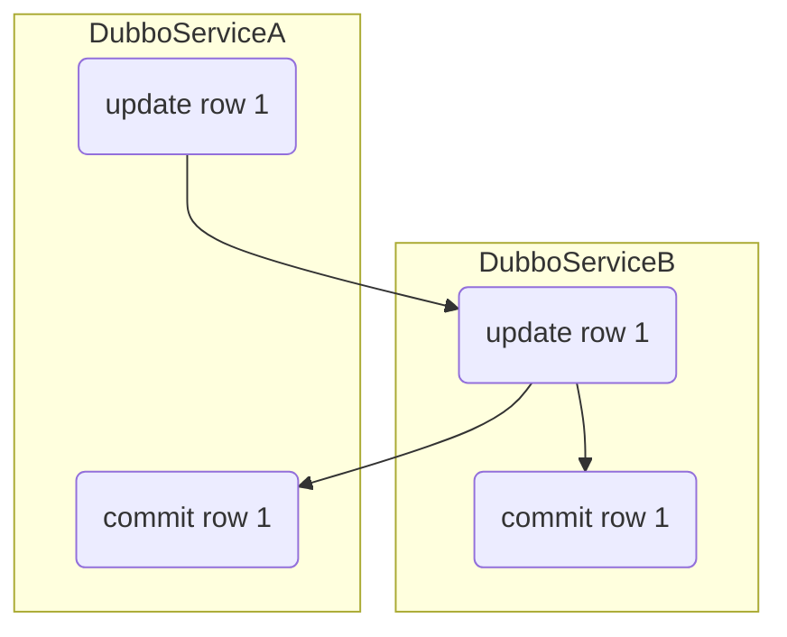

# 案例1，数据库死锁导致的服务超时

```mermaid
graph TB

subgraph DubboServiceB
c(update row 1)
d(commit row 1)
end
subgraph DubboServiceA
a(update row 1)
b(commit row 1)

a --> c
c --> b
c --> d
end
```

<!--stackedit_data:
eyJoaXN0b3J5IjpbOTg5NzU2NjAzXX0=
-->