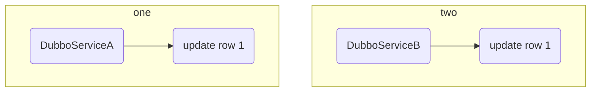

# 案例1，数据库死锁导致的服务超时

```mermaid
graph TB

subgraph two
c(DubboServiceB) --> d(update row 1)
end
subgraph one
a(DubboServiceA) --> b(update row 1)
end
```

<!--stackedit_data:
eyJoaXN0b3J5IjpbNjkzNDcwODYzXX0=
-->