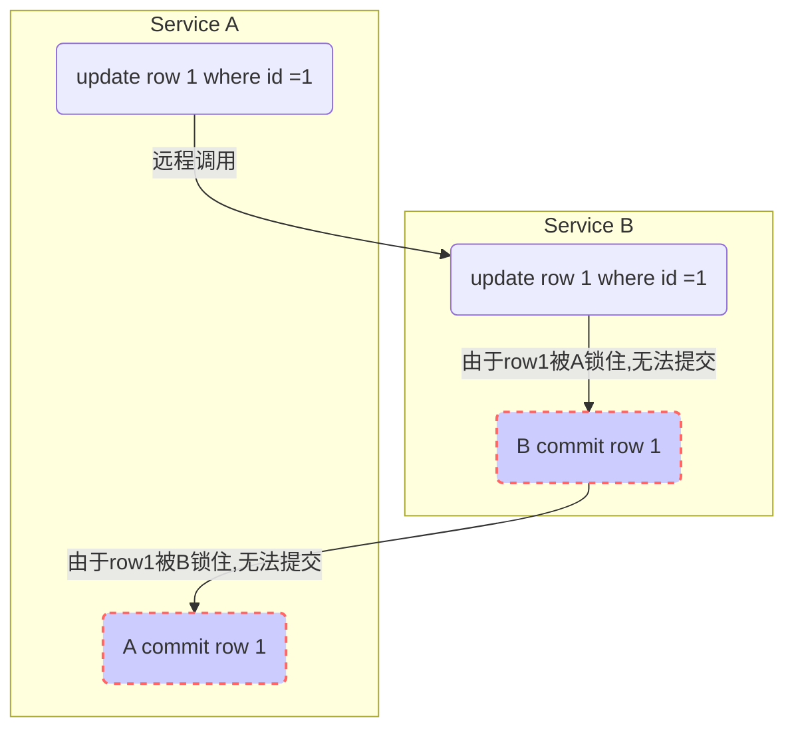

# 案例1，数据库锁导致的服务超时

几种情况(不考虑网络延迟)：
>- 1、如果B commit的超时时间大于A->B的超时时间：
>>- A->B超时，导致A事务回滚
>>- B commit事务成功

>- 2、如果B commit的超时时间小于A->B的超时时间：
>>- A->B成功，同时
>>- 如果A 
<!--stackedit_data:
eyJoaXN0b3J5IjpbLTEyNjc1OTI5NzNdfQ==
-->