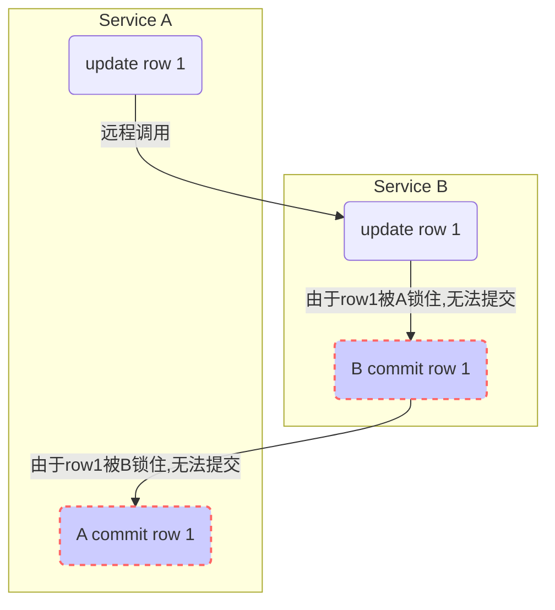

# 案例1，数据库死锁导致的服务超时

```mermaid
graph TB

subgraph Service B
c(update row 1)
d(B commit row 1)
end
subgraph Service A
a(update row 1)
b(A commit row 1)

a --远程调用--> c
d --由于row1被B锁住,无法提交--> b
c --由于row1被A锁住,无法提交--> d

style d fill:#ccf,stroke:#f66,stroke-width:2px,stroke-dasharray: 5, 5
style b fill:#ccf,stroke:#f66,stroke-width:2px,stroke-dasharray: 5, 5

end
```
几种情况：
>- 1、如果B commit的超时时间大于A->B的超时时间则：
>>- 
>- Service A 由于超时导致远程调用ServiceB失败，造成
row 1的数据回滚

<!--stackedit_data:
eyJoaXN0b3J5IjpbMjYxMDE4Njk3XX0=
-->